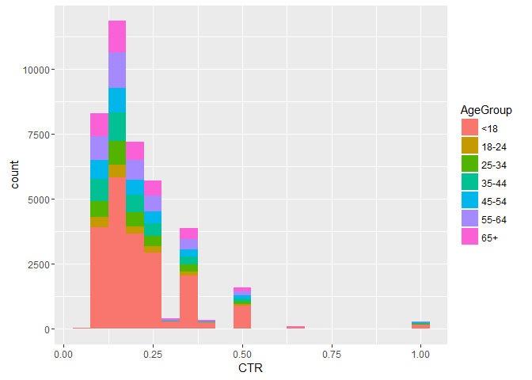
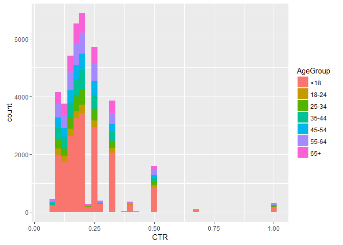
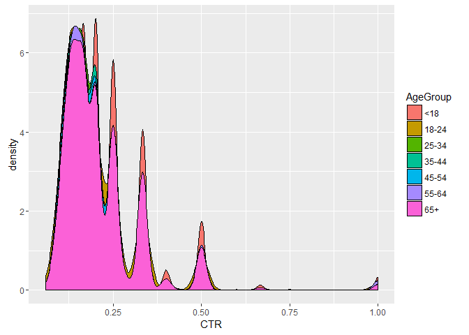

Introduction
============

This is an analysis for New York Times home page ad click through rates.
The data represents one simulated days’ worth of ads during May 2012.
Each row represents a user.

The raw data contains the following fields: - Age - Gender (0 = female
and 1 = male) - Number of Impressions - Number of Clicks- Whether user
was logged in

Data was downloaded from:
<http://stat.columbia.edu/~rachel/datasets/nyt1.csv>.

The following libraries were used.

    library("ggplot2")
    library("doBy")

Load the CSV file into a dataframe.

    #Read in data
    nyt <- read.table("nyt1.csv",header=TRUE, ",")
    class(data)

    ## [1] "function"

Use the cut function to categorize the users into various age
categories.

    #Catagorize by age
    bins <- c(-Inf,18,24,34,44,54,64,Inf)
    nyt$AgeGroup = cut(nyt$Age,bins)
    levels(nyt$AgeGroup) <- c("<18", "18-24", "25-34", "35-44", "45-54", "55-64", "65+")

Remove observations were no ad impressions were made.

    #Subset data where Impressions > 0
    ImpSub = subset(nyt, Impressions > 0)

Create new variable, click through rate(CTR), which is simply clicks
divided by number of impressions.

    #Create click through rate variable
    ImpSub$CTR = ImpSub$Clicks/ImpSub$Impressions
    head(ImpSub, 100)

    ##     Age Gender Impressions Clicks Signed_In AgeGroup        CTR
    ## 1    36      0           3      0         1    35-44 0.00000000
    ## 2    73      1           3      0         1      65+ 0.00000000
    ## 3    30      0           3      0         1    25-34 0.00000000
    ## 4    49      1           3      0         1    45-54 0.00000000
    ## 5    47      1          11      0         1    45-54 0.00000000
    ## 6    47      0          11      1         1    45-54 0.09090909
    ## 7     0      0           7      1         0      <18 0.14285714
    ## 8    46      0           5      0         1    45-54 0.00000000
    ## 9    16      0           3      0         1      <18 0.00000000
    ## 10   52      0           4      0         1    45-54 0.00000000
    ## 11    0      0           8      1         0      <18 0.12500000
    ## 12   21      0           3      0         1    18-24 0.00000000
    ## 13    0      0           4      0         0      <18 0.00000000
    ## 14   57      0           6      0         1    55-64 0.00000000
    ## 15   31      0           5      0         1    25-34 0.00000000
    ## 16    0      0           6      0         0      <18 0.00000000
    ## 17   40      1           3      0         1    35-44 0.00000000
    ## 18   31      1           5      0         1    25-34 0.00000000
    ## 19   38      0           4      0         1    35-44 0.00000000
    ## 20    0      0           5      0         0      <18 0.00000000
    ## 21   59      1           4      0         1    55-64 0.00000000
    ## 22   61      0           6      0         1    55-64 0.00000000
    ## 23   48      0           7      0         1    45-54 0.00000000
    ## 24   29      1           2      0         1    25-34 0.00000000
    ## 25    0      0           4      0         0      <18 0.00000000
    ## 26   19      1           4      0         1    18-24 0.00000000
    ## 27   19      0           3      0         1    18-24 0.00000000
    ## 28   48      1           9      0         1    45-54 0.00000000
    ## 29   48      1           4      0         1    45-54 0.00000000
    ## 30   21      1           5      0         1    18-24 0.00000000
    ## 31   23      0           4      0         1    18-24 0.00000000
    ## 32   66      1           3      0         1      65+ 0.00000000
    ## 33   23      1           7      0         1    18-24 0.00000000
    ## 34   44      1           4      0         1    35-44 0.00000000
    ## 35   32      0           2      0         1    25-34 0.00000000
    ## 36   22      1           2      0         1    18-24 0.00000000
    ## 37   30      1           8      0         1    25-34 0.00000000
    ## 38   74      0           2      0         1      65+ 0.00000000
    ## 39   65      1           5      0         1      65+ 0.00000000
    ## 40    0      0           7      2         0      <18 0.28571429
    ## 41   32      1           9      0         1    25-34 0.00000000
    ## 42    0      0           4      0         0      <18 0.00000000
    ## 43   61      0           2      0         1    55-64 0.00000000
    ## 44   63      1           4      0         1    55-64 0.00000000
    ## 45   36      1           1      0         1    35-44 0.00000000
    ## 46   35      0           7      0         1    35-44 0.00000000
    ## 47    0      0           3      0         0      <18 0.00000000
    ## 48    0      0           7      0         0      <18 0.00000000
    ## 49   73      0           4      0         1      65+ 0.00000000
    ## 50    0      0           5      0         0      <18 0.00000000
    ## 51    0      0           5      0         0      <18 0.00000000
    ## 52   33      0           4      0         1    25-34 0.00000000
    ## 53   34      0           5      0         1    25-34 0.00000000
    ## 54   48      1           1      0         1    45-54 0.00000000
    ## 55   43      1           4      0         1    35-44 0.00000000
    ## 56   59      1           2      0         1    55-64 0.00000000
    ## 57   34      0           3      0         1    25-34 0.00000000
    ## 58   22      0           5      0         1    18-24 0.00000000
    ## 59   18      1           1      0         1      <18 0.00000000
    ## 60    0      0           4      0         0      <18 0.00000000
    ## 61    0      0           8      0         0      <18 0.00000000
    ## 62   17      1           6      0         1      <18 0.00000000
    ## 63   30      0           5      0         1    25-34 0.00000000
    ## 64    0      0           2      1         0      <18 0.50000000
    ## 65   57      0           4      0         1    55-64 0.00000000
    ## 66   62      0           5      0         1    55-64 0.00000000
    ## 67   27      0           4      0         1    25-34 0.00000000
    ## 68   11      0           5      0         1      <18 0.00000000
    ## 69   38      0           6      0         1    35-44 0.00000000
    ## 70   21      1           4      0         1    18-24 0.00000000
    ## 71   42      0           4      0         1    35-44 0.00000000
    ## 72   41      0          10      0         1    35-44 0.00000000
    ## 73    0      0           6      1         0      <18 0.16666667
    ## 74   42      0           6      0         1    35-44 0.00000000
    ## 75   14      0           7      0         1      <18 0.00000000
    ## 76   64      1           7      1         1    55-64 0.14285714
    ## 77    0      0           5      0         0      <18 0.00000000
    ## 78   24      1           5      0         1    18-24 0.00000000
    ## 79   29      0           4      0         1    25-34 0.00000000
    ## 80   26      1           5      0         1    25-34 0.00000000
    ## 81   18      0           3      0         1      <18 0.00000000
    ## 82   22      0           5      0         1    18-24 0.00000000
    ## 83    0      0           3      0         0      <18 0.00000000
    ## 84    0      0           1      0         0      <18 0.00000000
    ## 85   42      0           2      0         1    35-44 0.00000000
    ## 86    0      0           7      1         0      <18 0.14285714
    ## 87    0      0           5      0         0      <18 0.00000000
    ## 88    0      0           4      0         0      <18 0.00000000
    ## 89   22      1           4      0         1    18-24 0.00000000
    ## 90   39      1           4      0         1    35-44 0.00000000
    ## 91   61      1           1      0         1    55-64 0.00000000
    ## 92   47      0           4      0         1    45-54 0.00000000
    ## 93    0      0           1      0         0      <18 0.00000000
    ## 94    0      0           5      0         0      <18 0.00000000
    ## 95   19      1           8      0         1    18-24 0.00000000
    ## 96   48      1           6      0         1    45-54 0.00000000
    ## 97   71      0           4      0         1      65+ 0.00000000
    ## 98   31      1           3      0         1    25-34 0.00000000
    ## 99   43      0           5      0         1    35-44 0.00000000
    ## 100   0      0           7      0         0      <18 0.00000000

Plot histogram of impression's distribution.

    #plot distribution of CTR
    ggplot(subset(ImpSub,CTR>0), aes(x=CTR, fill=AgeGroup)) + geom_histogram(binwidth = .05)

Plot histogram of CTR's distribution.

    #plot distribution of CTR
    ggplot(subset(ImpSub,CTR>0), aes(x=CTR, fill=AgeGroup)) +geom_histogram(binwidth = .05)

Create new CTR group variable.

    ctrbins <- c(-Inf,0.2,0.4,0.6,0.8,Inf)
    ImpSub$CTRGroup = cut(ImpSub$CTR,ctrbins,right=FALSE)
    levels(ImpSub$CTRGroup) <- c("CTR< 0.2", "0.2<=CTR<0.4", "0.4<=CTR<0.6", "0.6<=CTR<0.8", "CTR>0.8")

Output summary stats.

    #Get mean of age
    mean(ImpSub$Age)

    ## [1] 29.48401

    #Get mean of Impressions
    mean(ImpSub$Impressions)

    ## [1] 5.04103

    #Get mean of CTR
    mean(ImpSub$CTR)

    ## [1] 0.01847053

    #Percentage of Males and Femals
    cbind( Freq=table(ImpSub$Gender), relative=100*prop.table(table(ImpSub$Gender)))

    ##     Freq relative
    ## 0 288229 63.29487
    ## 1 167146 36.70513

    #Percentage of Signed in
    cbind( Freq=table(ImpSub$Signed_In), relative=100*prop.table(table(ImpSub$Signed_In)))

    ##     Freq relative
    ## 0 136177 29.90436
    ## 1 319198 70.09564

Output summary by AgeGroup variable.

    #Get means of Impressions by Age group
    summaryBy(Impressions~AgeGroup,data=ImpSub,FUN=c(mean))

    ##   AgeGroup Impressions.mean
    ## 1      <18         5.033534
    ## 2    18-24         5.043240
    ## 3    25-34         5.026055
    ## 4    35-44         5.054749
    ## 5    45-54         5.045172
    ## 6    55-64         5.053484
    ## 7      65+         5.046925

    #Get means of CTR by Age group
    summaryBy(CTR~AgeGroup,data=ImpSub,FUN=c(mean))

    ##   AgeGroup    CTR.mean
    ## 1      <18 0.028141310
    ## 2    18-24 0.009720481
    ## 3    25-34 0.010146329
    ## 4    35-44 0.010286330
    ## 5    45-54 0.009957612
    ## 6    55-64 0.020306816
    ## 7      65+ 0.029802702

    #Get means of Gender by Age group
    summaryBy(Gender~AgeGroup,data=ImpSub,FUN=c(mean))

    ##   AgeGroup Gender.mean
    ## 1      <18   0.0790648
    ## 2    18-24   0.5339864
    ## 3    25-34   0.5319977
    ## 4    35-44   0.5317072
    ## 5    45-54   0.5292192
    ## 6    55-64   0.5359633
    ## 7      65+   0.3632512

    #Get means of Signed_In by Age group
    summaryBy(Signed_In~AgeGroup,data=ImpSub,FUN=c(mean))

    ##   AgeGroup Signed_In.mean
    ## 1      <18      0.1231528
    ## 2    18-24      1.0000000
    ## 3    25-34      1.0000000
    ## 4    35-44      1.0000000
    ## 5    45-54      1.0000000
    ## 6    55-64      1.0000000
    ## 7      65+      1.0000000

Create new table based on CTRGroup and AgeGroup vectors.

    CTRAgeGroup <- table(ImpSub$CTRGroup,ImpSub$AgeGroup)

Plot histogram of CTR's distribution.

    ggplot(subset(ImpSub,CTR>0), aes(x=CTR, fill=AgeGroup)) +
      geom_histogram(binwidth = .025)

Plot interesting density plot of CTR and AgeGroup.

    ggplot(subset(ImpSub,CTR>0), aes(x=CTR, fill=AgeGroup)) +
      geom_density()

